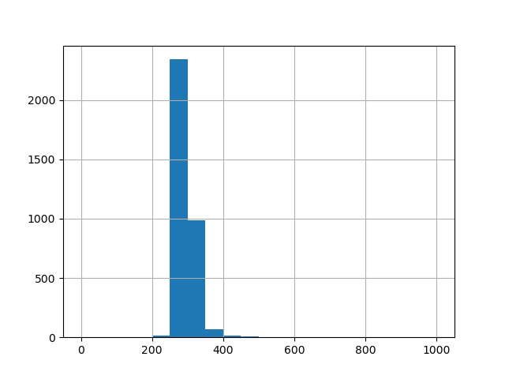
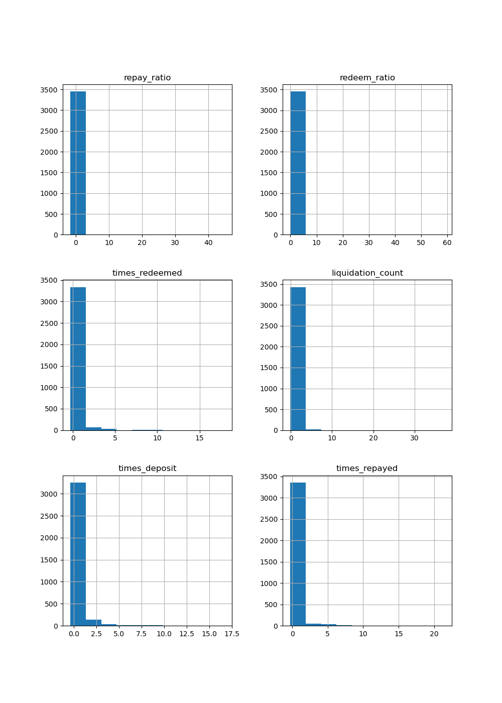

# Wallet Credit Score Analysis

This document analyzes the wallet credit scores generated from the rule-based model applied to Aave V2 transaction data.

---

## Score Distribution

> (Generated using matplotlib in `analysis.ipynb`)

---

## Behavior of Low-Scoring Wallets (0–300)
- **Common Patterns**:
  - High `liquidation_count` (frequent liquidations)
  - Very low or zero `repay_ratio`
  - Little or no deposit activity

---

## Behavior of High-Scoring Wallets (800–1000)
- **Common Patterns**:
  - Consistently high `repay_ratio` and `redeem_ratio`
  - Multiple deposits and repayments
  - Zero or very low liquidations

---

## Observations
- The score distribution is **skewed** with most wallets scoring between 200–700.
- Very few wallets score near 1000, indicating **strict rules** and real behavioral differences.